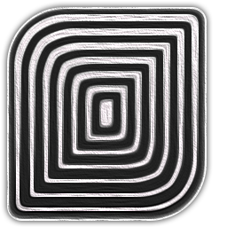
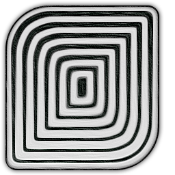
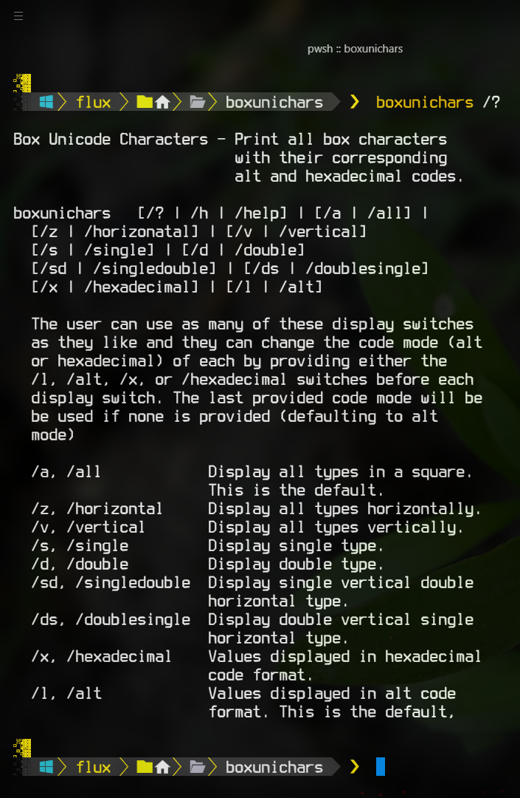
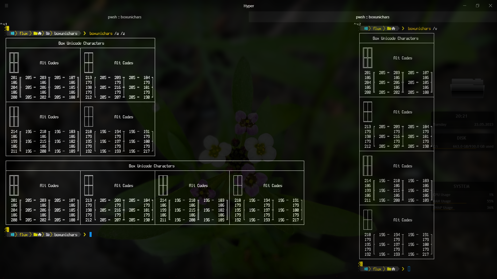
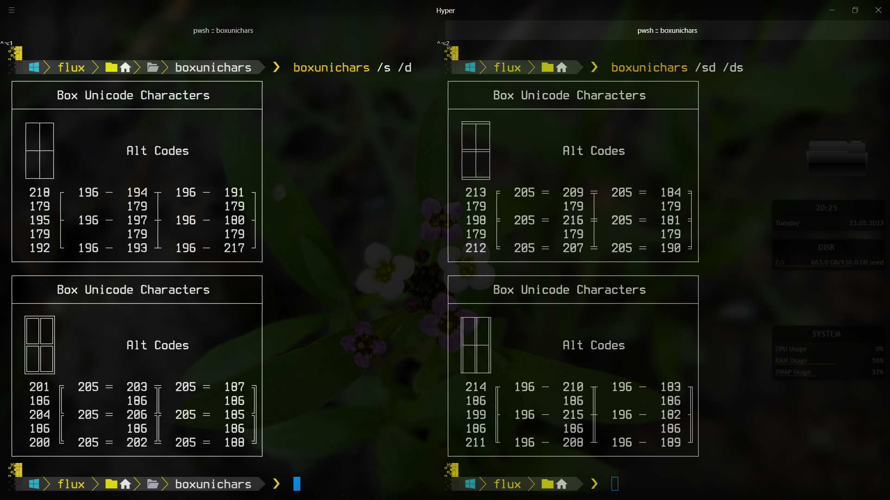

# Box Unicode Characters 


<!-- ***This project is*** ![Under Construction](https://img.shields.io/static/v1?logo=data:image/png;base64,iVBORw0KGgoAAAANSUhEUgAAAA4AAAAOCAYAAAAfSC3RAAACmElEQVQokUWSa0iTcRTGn//26u4b6ZQ0U8lKMqykwPpgZVBEHyLp8jEoIZJADCQ0iCiStIwuZmHRioIuroQss2VkrkIrdeFckiZqdhctTXPOve8Tr7M6X8/zO+fwPEfIwy7IwQA0GgExGYQwyhCmMLRX1z2hJCJSN+xZgqAZnPgCaAUQ0EHICjSYLlKBCDdNQb7HLmeRoy3zQFnzYk/1WTckGUIXCVD+Kw+BpAxtuBXCpkN7bdXt/JL3W3J3xuHg3iTsL/NkNFWVPoWkQOj/wxooCrRhFgiTjI4n9ZVHHQObjxVEY8UGIi1zEhVFCahwdq5qvn+hHkKC0EcBigxwvAnkW3ge7L6TMi+VztOLOOKOY8ulKL68GM2emnjeLF3AZSlz2FCZ6yaHwLGv6pkv8MyxsUoHLcsLwBuHwE0rtdy2UuLWNTpmpkkszQEfnAPDAd47tbaB7NaJR+eXujfmtGTUXgFWp5uwPd8Oi1GBJEmwWYlP34L4PSFw7chPeD+MYnkWUVmy0CeNfe5N8ANIjNWpNmHzqklYrDIGRwRm2gXsM/xofRMOf1AgcbYOAfgxMvgxCmS9+dbh5A6VarxuIMdBDoJ0g+vSreytNpAEux7qqWrK82I+kC2xYOAzyFbz5QNJPrXhdRo4XK/n3WILkxPsbKqwsr8xBB3PjukhGyJJv+qqB+QvkN0mR2Fim5pU1hobzxTYOPbcyJoTNpoAlu6wdZKvIslR0O9VXe0Clc5p2Ge4WDh36ux3ThM/1RqnNhXvilU32cjvINtAf4cKdkzlSHpBTqgNY11JfLtFA+o14NU8Wx/piggNfg2yGVR8EF9/dP37PyCIoDQLs8z9hmv71nsC4wFz9klX2tD4/AEG+gBoQ7KghD8MZ2xdnt7s7wAAAABJRU5ErkJggg==&label=Under&message=Construction&style=for-the-badge&labelColor=1D1D1D&color=ffff99) -->

---

- [Box Unicode Characters ](#box-unicode-characters-)
  - [About](#about)
    - [Description](#description)
    - [Motivation](#motivation)
  - [Support Me If You Like](#support-me-if-you-like)
  - [Usage](#usage)
    - [Environment](#environment)
    - [How To Use](#how-to-use)
    - [Display types](#display-types)
    - [Code Types](#code-types)
    - [Other Usage](#other-usage)
    - [Examples](#examples)
  - [Project Information](#project-information)
    - [Source File Quality](#source-file-quality)
    - [File MD5 Hashes](#file-md5-hashes)
    - [Current Windows X86 MD5](#current-windows-x86-md5)
    - [Current Windows X64 MD5](#current-windows-x64-md5)
    - [Other Miscellaneous File Information](#other-miscellaneous-file-information)
  - [Notes](#notes)
    - [Note 1](#note-1)
    - [Note 2](#note-2)
  - [Media](#media)
  - [LICENSE](#license)

---

## About

&#x41;&#x6c;&#x6c;&#x20;&#x66;&#x69;&#x6c;&#x65;&#x73;&#x20;&#x63;&#x61;&#x6e;&#x20;&#x62;&#x65;&#x20;&#x66;&#x6f;&#x75;&#x6e;&#x64;&#x20;&#x6f;&#x6e;&#x20;&#x74;&#x68;&#x65;&#x20;[Releases](https://github.com/Lateralus138/boxunichars/releases)&#x20;&#x70;&#x61;&#x67;&#x65;&#x2e;

### Description

&#x54;&#x68;&#x69;&#x73;&#x20;&#x57;&#x69;&#x6e;&#x64;&#x6f;&#x77;&#x73;&#x20;&#x63;&#x6f;&#x6d;&#x6d;&#x61;&#x6e;&#x64;&#x20;&#x6c;&#x69;&#x6e;&#x65;&#x20;&#x74;&#x6f;&#x6f;&#x6c;&#x20;&#x64;&#x69;&#x73;&#x70;&#x6c;&#x61;&#x79;&#x73;&#x20;&#x74;&#x68;&#x65;&#x20;&#x76;&#x61;&#x72;&#x69;&#x6f;&#x75;&#x73;&#x20;**Unicode box characters**<sup>[[1](#note-1)]</sup>&#x20;&#x69;&#x6e;&#x20;&#x73;&#x65;&#x76;&#x65;&#x72;&#x61;&#x6c;&#x20;&#x6e;&#x69;&#x63;&#x65;&#x20;&#x66;&#x6f;&#x72;&#x6d;&#x61;&#x74;&#x73;&#x20;&#x77;&#x69;&#x74;&#x68;&#x20;&#x74;&#x68;&#x65;&#x20;&#x63;&#x6f;&#x72;&#x72;&#x65;&#x73;&#x70;&#x6f;&#x6e;&#x64;&#x69;&#x6e;&#x67;&#x20;&#x61;&#x6c;&#x74;&#x20;&#x6f;&#x72;&#x20;&#x68;&#x65;&#x78;&#x61;&#x64;&#x65;&#x63;&#x69;&#x6d;&#x61;&#x6c;&#x20;&#x63;&#x6f;&#x64;&#x65;&#x73;&period;

&#x54;&#x68;&#x69;&#x73;&#x20;&#x57;&#x69;&#x6e;&#x64;&#x6f;&#x77;&#x73;&#x20;&#x63;&#x6f;&#x6d;&#x6d;&#x61;&#x6e;&#x64;&#x20;&#x6c;&#x69;&#x6e;&#x65;&#x20;&#x74;&#x6f;&#x6f;&#x6c;&#x20;&#x64;&#x69;&#x73;&#x70;&#x6c;&#x61;&#x79;&#x73;&#x20;&#x74;&#x68;&#x65;&#x20;&#x76;&#x61;&#x72;&#x69;&#x6f;&#x75;&#x73;&#x20;&#x55;&#x6e;&#x69;&#x63;&#x6f;&#x64;&#x65;&#x20;&#x62;&#x6f;&#x78;&#x20;&#x63;&#x68;&#x61;&#x72;&#x61;&#x63;&#x74;&#x65;&#x72;&#x73;&#x20;&#x69;&#x6e;&#x20;&#x73;&#x65;&#x76;&#x65;&#x72;&#x61;&#x6c;&#x20;&#x6e;&#x69;&#x63;&#x65;&#x20;&#x66;&#x6f;&#x72;&#x6d;&#x61;&#x74;&#x73;&#x20;&#x77;&#x69;&#x74;&#x68;&#x20;&#x74;&#x68;&#x65;&#x20;&#x63;&#x6f;&#x72;&#x72;&#x65;&#x73;&#x70;&#x6f;&#x6e;&#x64;&#x69;&#x6e;&#x67;&#x20;&#x61;&#x6c;&#x74;&#x20;&#x6f;&#x72;&#x20;&#x68;&#x65;&#x78;&#x61;&#x64;&#x65;&#x63;&#x69;&#x6d;&#x61;&#x6c;&#x20;&#x63;&#x6f;&#x64;&#x65;&#x73;&period;

### Motivation

&#x49;&#x20;&#x75;&#x73;&#x65;&#x20;&#x62;&#x6f;&#x78;&#x20;&#x63;&#x68;&#x61;&#x72;&#x61;&#x63;&#x74;&#x65;&#x72;&#x73;&#x20;&#x66;&#x6f;&#x72;&#x20;&#x61;&#x6c;&#x6c;&#x20;&#x73;&#x6f;&#x72;&#x74;&#x73;&#x20;&#x6f;&#x66;&#x20;&#x63;&#x6f;&#x6d;&#x6d;&#x65;&#x6e;&#x74;&#x73;&#x20;&#x69;&#x6e;&#x20;&#x70;&#x72;&#x6f;&#x67;&#x72;&#x61;&#x6d;&#x6d;&#x69;&#x6e;&#x67;&comma;&#x20;&#x73;&#x63;&#x72;&#x69;&#x70;&#x74;&#x69;&#x6e;&#x67;&comma;&#x20;&#x61;&#x6e;&#x64;&#x20;&#x63;&#x6f;&#x6e;&#x66;&#x69;&#x67;&#x75;&#x72;&#x61;&#x74;&#x69;&#x6f;&#x6e;&#x20;&#x66;&#x69;&#x6c;&#x65;&#x73;&#x20;&#x61;&#x6e;&#x64;&#x20;&#x73;&#x6f;&#x20;&#x49;&#x20;&#x77;&#x72;&#x6f;&#x74;&#x65;&#x20;&#x74;&#x68;&#x69;&#x73;&#x20;&#x74;&#x6f;&#x6f;&#x6c;&#x20;&#x74;&#x6f;&#x20;&#x71;&#x75;&#x69;&#x63;&#x6b;&#x6c;&#x79;&#x20;&#x72;&#x65;&#x66;&#x65;&#x72;&#x65;&#x6e;&#x63;&#x65;&#x20;&#x74;&#x68;&#x65;&#x69;&#x72;&#x20;&#x63;&#x6f;&#x64;&#x65;&#x73;&#x20;&#x61;&#x6e;&#x64;&sol;&#x6f;&#x72;&#x20;&#x63;&#x6f;&#x70;&#x79;&#x20;&#x66;&#x72;&#x6f;&#x6d;&#x20;&#x74;&#x68;&#x65;&#x20;&#x63;&#x6f;&#x6d;&#x6d;&#x61;&#x6e;&#x64;&#x20;&#x6c;&#x69;&#x6e;&#x65;&period;

---

## Support Me If You Like

&#x49;&#x66;&#x20;&#x79;&#x6f;&#x75;&#x20;&#x6c;&#x69;&#x6b;&#x65;&#x20;&#x61;&#x6e;&#x79;&#x20;&#x6f;&#x66;&#x20;&#x74;&#x68;&#x65;&#x20;&#x70;&#x72;&#x6f;&#x6a;&#x65;&#x63;&#x74;&#x73;&#x20;&#x62;&#x65;&#x6c;&#x6f;&#x77;&#x20;&#x61;&#x6e;&#x64;&#x20;&#x63;&#x61;&#x72;&#x65;&#x20;&#x74;&#x6f;&#x20;&#x64;&#x6f;&#x6e;&#x61;&#x74;&#x65;&#x20;&#x74;&#x6f;&#x20;&#x6d;&#x79;&#x20;***PayPal***&#x3a;

[](https://paypal.me/ianapride?locale.x=en_US)

&#x4f;&#x72;&#x20;***Buy Me A Coffee***&#x20;&#x69;&#x66;&#x20;&#x79;&#x6f;&#x75;&#x72;&#x20;&#x70;&#x72;&#x65;&#x66;&#x65;&#x72;&#x3a;

[](https://www.buymeacoffee.com/ianalanpride)

---

## Usage

### Environment

&#x54;&#x68;&#x69;&#x73;&#x20;&#x69;&#x73;&#x20;&#x61;&#x20;**Windows**&#x20;&#x63;&#x6f;&#x6d;&#x6d;&#x61;&#x6e;&#x64;&#x20;&#x6c;&#x69;&#x6e;&#x65;&#x20;&#x74;&#x6f;&#x6f;&#x6c;&#x20;&#x66;&#x6f;&#x72;&#x20;**CMD**&#x20;&#x61;&#x6e;&#x64;&#x20;**PowerShell**&#x2e;&#x20;&#x54;&#x68;&#x65;&#x72;&#x65;&#x20;&#x61;&#x72;&#x65;&#x20;&#x62;&#x6f;&#x74;&#x68;&#x20;&#x78;&#x38;&#x36;&#x20;&lpar;&#x33;&#x32;&#x20;&#x62;&#x69;&#x74;&rpar;&#x20;&#x61;&#x6e;&#x64;&#x20;&#x78;&#x36;&#x34;&#x20;&lpar;&#x36;&#x34;&#x20;&#x62;&#x69;&#x74;&rpar;&#x20;&#x76;&#x65;&#x72;&#x73;&#x69;&#x6f;&#x6e;&#x73;&#x20;&#x6f;&#x66;&#x20;&#x74;&#x68;&#x65;&#x20;&#x65;&#x78;&#x65;&#x63;&#x75;&#x74;&#x61;&#x62;&#x6c;&#x65;&period;

### How To Use

&#x41;&#x73;&#x20;&#x77;&#x69;&#x74;&#x68;&#x20;&#x61;&#x6e;&#x79;&#x20;&#x70;&#x6f;&#x72;&#x74;&#x61;&#x62;&#x6c;&#x65;&#x20;&#x70;&#x72;&#x6f;&#x67;&#x72;&#x61;&#x6d;&#x20;&#x74;&#x68;&#x69;&#x73;&#x20;&#x63;&#x61;&#x6e;&#x20;&#x62;&#x65;&#x20;&#x70;&#x6c;&#x61;&#x63;&#x65;&#x64;&#x20;&#x61;&#x6e;&#x79;&#x77;&#x68;&#x65;&#x72;&#x65;&#x20;&#x79;&#x6f;&#x75;&#x20;&#x6c;&#x69;&#x6b;&#x65;&#x20;&#x6f;&#x6e;&#x20;&#x79;&#x6f;&#x75;&#x72;&#x20;&#x6d;&#x61;&#x63;&#x68;&#x69;&#x6e;&#x65;&#x2c;&#x20;&#x62;&#x75;&#x74;&#x20;&#x6d;&#x6f;&#x72;&#x65;&#x20;&#x70;&#x72;&#x65;&#x66;&#x65;&#x72;&#x61;&#x62;&#x6c;&#x79;&#x20;&#x69;&#x6e;&#x20;&#x61;&#x20;&#x64;&#x69;&#x72;&#x65;&#x63;&#x74;&#x6f;&#x72;&#x79;&#x20;&#x74;&#x68;&#x61;&#x74;&#x20;&#x69;&#x73;&#x20;&#x69;&#x6e;&#x20;&#x79;&#x6f;&#x75;&#x72;&#x20;`%PATH%`&#x20;&#x65;&#x6e;&#x76;&#x69;&#x72;&#x6f;&#x6e;&#x6d;&#x65;&#x6e;&#x74;&#x20;&#x76;&#x61;&#x72;&#x69;&#x61;&#x62;&#x6c;&#x65;&#x20;&#x73;&#x6f;&#x20;&#x79;&#x6f;&#x75;&#x20;&#x63;&#x61;&#x6e;&#x20;&#x72;&#x75;&#x6e;&#x20;&#x69;&#x74;&#x20;&#x77;&#x69;&#x74;&#x68;&#x6f;&#x75;&#x74;&#x20;&#x61;&#x20;&#x66;&#x75;&#x6c;&#x6c;&#x20;&#x70;&#x61;&#x74;&#x68;&#x20;&#x28;`boxunichars`&#x20;&#x66;&#x6f;&#x72;&#x20;&#x65;&#x78;&#x61;&#x6d;&#x70;&#x6c;&#x65;&#x29;&#x2e;&#x20;&#x49;&#x20;&#x72;&#x65;&#x63;&#x6f;&#x6d;&#x6d;&#x65;&#x6e;&#x64;&#x20;&#x75;&#x73;&#x69;&#x6e;&#x67;&#x20;&#x61;&#x20;&#x64;&#x65;&#x64;&#x69;&#x63;&#x61;&#x74;&#x65;&#x64;&#x20;*Bin*&#x20;&#x64;&#x69;&#x72;&#x65;&#x63;&#x74;&#x6f;&#x72;&#x79;&#x2c;&#x20;&#x62;&#x75;&#x74;&#x20;&#x6f;&#x66;&#x20;&#x63;&#x6f;&#x75;&#x72;&#x73;&#x65;&#x2c;&#x20;&#x69;&#x74;&#x27;&#x73;&#x20;&#x79;&#x6f;&#x75;&#x72;&#x20;&#x63;&#x68;&#x6f;&#x69;&#x63;&#x65;&#x2e;&#x20;&#x49;&#x66;&#x20;&#x79;&#x6f;&#x75;&#x72;&#x20;&#x70;&#x61;&#x74;&#x68;&#x20;&#x69;&#x73;&#x6e;&#x27;&#x74;&#x20;&#x61;&#x6c;&#x72;&#x65;&#x61;&#x64;&#x79;&#x20;&#x69;&#x6e;&#x20;&#x79;&#x6f;&#x75;&#x72;&#x20;`%PATH%`&#x20;&#x65;&#x6e;&#x76;&#x69;&#x72;&#x6f;&#x6e;&#x6d;&#x65;&#x6e;&#x74;&#x20;&#x74;&#x68;&#x65;&#x6e;&#x20;&#x49;&#x20;&#x73;&#x75;&#x67;&#x67;&#x65;&#x73;&#x74;&#x20;&#x61;&#x64;&#x64;&#x69;&#x6e;&#x67;&#x20;&#x69;&#x74;<sup>[[2](#note-2)]</sup>&#x2c;&#x20;&#x62;&#x75;&#x74;&#x20;&#x69;&#x66;&#x20;&#x6e;&#x6f;&#x74;&#x20;&#x74;&#x68;&#x65;&#x6e;&#x20;&#x79;&#x6f;&#x75;&#x20;&#x68;&#x61;&#x76;&#x65;&#x20;&#x70;&#x72;&#x6f;&#x76;&#x69;&#x64;&#x65;&#x20;&#x74;&#x68;&#x65;&#x20;&#x66;&#x75;&#x6c;&#x6c;&#x20;&#x70;&#x61;&#x74;&#x68;&#x20;&#x28;`C:\Path\To\boxunichars.exe`&#x20;&#x66;&#x6f;&#x72;&#x20;&#x65;&#x78;&#x61;&#x6d;&#x70;&#x6c;&#x65;&#x29;&#x20;&#x77;&#x68;&#x65;&#x6e;&#x20;&#x65;&#x78;&#x65;&#x63;&#x75;&#x74;&#x69;&#x6e;&#x67;&#x20;&#x74;&#x68;&#x65;&#x20;&#x70;&#x72;&#x6f;&#x67;&#x72;&#x61;&#x6d;&#x2e;

&#x54;&#x68;&#x69;&#x73;&#x20;&#x77;&#x69;&#x6c;&#x6c;&#x20;&#x64;&#x69;&#x73;&#x70;&#x6c;&#x61;&#x79;&#x20;&#x61;&#x6c;&#x6c;&#x20;&#x34;&#x20;&#x62;&#x6f;&#x78;&#x20;&#x74;&#x79;&#x70;&#x65;&#x73;&#x20;&#x69;&#x6e;&#x20;&#x61;&#x20;&#x32;&#x78;&#x32;&#x20;&#x73;&#x71;&#x75;&#x61;&#x72;&#x65;&#x20;&#x77;&#x69;&#x74;&#x68;&#x20;&#x61;&#x6c;&#x74;&#x20;&#x63;&#x6f;&#x64;&#x65;&#x73;&#x20;&#x62;&#x79;&#x20;&#x64;&#x65;&#x66;&#x61;&#x75;&#x6c;&#x74;&comma;&#x20;&#x62;&#x75;&#x74;&#x20;&#x74;&#x68;&#x65;&#x72;&#x65;&#x20;&#x61;&#x72;&#x65;&#x20;&#x36;&#x20;&#x6f;&#x74;&#x68;&#x65;&#x72;&#x20;&#x64;&#x69;&#x73;&#x70;&#x6c;&#x61;&#x79;&#x20;&#x74;&#x79;&#x70;&#x65;&#x73;&semi;&#x20;&#x32;&#x20;&#x61;&#x64;&#x64;&#x69;&#x74;&#x69;&#x6f;&#x6e;&#x61;&#x6c;&#x20;**all**&#x20;&#x74;&#x79;&#x70;&#x65;&#x73;&#x20;&#x61;&#x6e;&#x64;&#x20;&#x34;&#x20;**single**&#x20;&#x74;&#x79;&#x70;&#x65;&#x73;&#x20;&#x61;&#x6e;&#x64;&#x20;&#x65;&#x61;&#x63;&#x68;&#x20;&#x63;&#x61;&#x6e;&#x20;&#x62;&#x65;&#x20;&#x76;&#x69;&#x65;&#x77;&#x65;&#x64;&#x20;&#x61;&#x73;&#x20;&#x65;&#x69;&#x74;&#x68;&#x65;&#x72;&#x20;&#x61;&#x6c;&#x74;&#x20;&#x6f;&#x72;&#x20;&#x68;&#x65;&#x78;&#x61;&#x64;&#x65;&#x63;&#x69;&#x6d;&#x61;&#x6c;&#x20;&#x63;&#x6f;&#x64;&#x65;&#x73;&#x20;&#x77;&#x69;&#x74;&#x68;&#x20;&#x74;&#x68;&#x65;&#x20;&#x70;&#x72;&#x6f;&#x76;&#x69;&#x64;&#x65;&#x64;&#x20;&#x63;&#x6f;&#x72;&#x72;&#x65;&#x73;&#x70;&#x6f;&#x6e;&#x64;&#x69;&#x6e;&#x67;&#x20;&#x73;&#x77;&#x69;&#x74;&#x63;&#x68;&#x65;&#x73;&semi;

### Display types

- &#x41;&#x6c;&#x6c;
  1. &#x44;&#x65;&#x66;&#x61;&#x75;&#x6c;&#x74;&colon;&#x20;&#x61;&#x6c;&#x6c;&#x20;&#x34;&#x20;&#x6d;&#x61;&#x69;&#x6e;&#x20;&#x74;&#x79;&#x70;&#x65;&#x73;&#x20;&#x64;&#x69;&#x73;&#x70;&#x6c;&#x61;&#x79;&#x65;&#x64;&#x20;&#x69;&#x6e;&#x20;&#x61;&#x20;&#x32;&#x78;&#x32;&#x20;&#x73;&#x71;&#x75;&#x61;&#x72;&#x65;&period;
  2. &#x48;&#x6f;&#x72;&#x69;&#x7a;&#x6f;&#x6e;&#x74;&#x61;&#x6c;&colon;&#x20;&#x61;&#x6c;&#x6c;&#x20;&#x34;&#x20;&#x6d;&#x61;&#x69;&#x6e;&#x20;&#x74;&#x79;&#x70;&#x65;&#x73;&#x20;&#x64;&#x69;&#x73;&#x70;&#x6c;&#x61;&#x79;&#x65;&#x64;&#x20;&#x68;&#x6f;&#x72;&#x69;&#x7a;&#x6f;&#x6e;&#x74;&#x61;&#x6c;&#x6c;&#x79;&period;
  3. &#x56;&#x65;&#x72;&#x74;&#x69;&#x63;&#x61;&#x6c;&colon;&#x20;&#x61;&#x6c;&#x6c;&#x20;&#x34;&#x20;&#x6d;&#x61;&#x69;&#x6e;&#x20;&#x74;&#x79;&#x70;&#x65;&#x73;&#x20;&#x64;&#x69;&#x73;&#x70;&#x6c;&#x61;&#x79;&#x65;&#x64;&#x20;&#x76;&#x65;&#x72;&#x74;&#x69;&#x63;&#x61;&#x6c;&#x6c;&#x79;&period;

- &#x53;&#x69;&#x6e;&#x67;&#x6c;&#x65;
  1. &#x53;&#x69;&#x6e;&#x67;&#x6c;&#x65;&colon;&#x20;&#x53;&#x69;&#x6e;&#x67;&#x6c;&#x65;&#x20;&#x6c;&#x69;&#x6e;&#x65;&#x20;&#x62;&#x6f;&#x78;&#x20;&#x63;&#x68;&#x61;&#x72;&#x61;&#x63;&#x74;&#x65;&#x72;&#x73;&#x20;&#x6f;&#x6e;&#x6c;&#x79;&period;
  2. &#x44;&#x6f;&#x75;&#x62;&#x6c;&#x65;&colon;&#x20;&#x44;&#x6f;&#x75;&#x62;&#x6c;&#x65;&#x20;&#x6c;&#x69;&#x6e;&#x65;&#x20;&#x62;&#x6f;&#x78;&#x20;&#x63;&#x68;&#x61;&#x72;&#x61;&#x63;&#x74;&#x65;&#x72;&#x73;&#x20;&#x6f;&#x6e;&#x6c;&#x79;&period;
  3. &#x53;&#x69;&#x6e;&#x67;&#x6c;&#x65;&#x44;&#x6f;&#x75;&#x62;&#x6c;&#x65;&colon;&#x20;&#x53;&#x69;&#x6e;&#x67;&#x6c;&#x65;&#x20;&#x76;&#x65;&#x72;&#x74;&#x69;&#x63;&#x61;&#x6c;&#x20;&#x61;&#x6e;&#x64;&#x20;&#x64;&#x6f;&#x75;&#x62;&#x6c;&#x65;&#x20;&#x68;&#x6f;&#x72;&#x69;&#x7a;&#x6f;&#x6e;&#x74;&#x61;&#x6c;&#x20;&#x6c;&#x69;&#x6e;&#x65;&#x20;&#x62;&#x6f;&#x78;&#x20;&#x63;&#x68;&#x61;&#x72;&#x61;&#x63;&#x74;&#x65;&#x72;&#x73;&#x20;&#x6f;&#x6e;&#x6c;&#x79;&period;
  4. &#x44;&#x6f;&#x75;&#x62;&#x6c;&#x65;&#x53;&#x69;&#x6e;&#x67;&#x6c;&#x65;&colon;&#x20;&#x44;&#x6f;&#x75;&#x62;&#x6c;&#x65;&#x20;&#x76;&#x65;&#x72;&#x74;&#x69;&#x63;&#x61;&#x6c;&#x20;&#x61;&#x6e;&#x64;&#x20;&#x73;&#x69;&#x6e;&#x67;&#x6c;&#x65;&#x20;&#x68;&#x6f;&#x72;&#x69;&#x7a;&#x6f;&#x6e;&#x74;&#x61;&#x6c;&#x20;&#x6c;&#x69;&#x6e;&#x65;&#x20;&#x62;&#x6f;&#x78;&#x20;&#x63;&#x68;&#x61;&#x72;&#x61;&#x63;&#x74;&#x65;&#x72;&#x73;&#x20;&#x6f;&#x6e;&#x6c;&#x79;&period;

### Code Types

- &#x41;&#x6c;&#x74;&colon;&#x20;&#x43;&#x6f;&#x64;&#x65;&#x73;&#x20;&#x64;&#x69;&#x73;&#x70;&#x6c;&#x61;&#x79;&#x65;&#x64;&#x20;&#x61;&#x72;&#x65;&#x20;&#x6f;&#x66;&#x20;&#x74;&#x68;&#x65;&#x20;*Alt*&#x20;&#x74;&#x79;&#x70;&#x65;&period;
- &#x48;&#x65;&#x78;&#x61;&#x64;&#x65;&#x63;&#x69;&#x6d;&#x61;&#x6c;&colon;&#x20;&#x43;&#x6f;&#x64;&#x65;&#x73;&#x20;&#x64;&#x69;&#x73;&#x70;&#x6c;&#x61;&#x79;&#x65;&#x64;&#x20;&#x61;&#x72;&#x65;&#x20;&#x6f;&#x66;&#x20;&#x74;&#x68;&#x65;&#x20;*hexadecimal*&#x20;&#x74;&#x79;&#x70;&#x65;&period;

### Other Usage

&#x41;&#x6c;&#x6c;&#x20;&#x74;&#x79;&#x70;&#x65;&#x73;&#x20;&#x63;&#x61;&#x6e;&#x20;&#x62;&#x65;&#x20;&#x64;&#x69;&#x73;&#x70;&#x6c;&#x61;&#x79;&#x65;&#x64;&#x20;&#x69;&#x6e;&#x20;&#x62;&#x6f;&#x74;&#x68;&#x20;&#x63;&#x6f;&#x64;&#x65;&#x20;&#x66;&#x6f;&#x72;&#x6d;&#x61;&#x74;&#x73;&#x20;&#x61;&#x6e;&#x64;&#x20;&#x61;&#x6c;&#x6c;&#x20;&#x61;&#x74;&#x20;&#x74;&#x68;&#x65;&#x20;&#x73;&#x61;&#x6d;&#x65;&#x20;&#x74;&#x69;&#x6d;&#x65;&#x20;&#x69;&#x66;&#x20;&#x6e;&#x65;&#x65;&#x64;&#x65;&#x64;&period;&#x20;&#x49;&#x66;&#x20;&#x6e;&#x6f;&#x74;&#x20;&#x73;&#x77;&#x69;&#x74;&#x63;&#x68;&#x65;&#x73;&#x20;&#x61;&#x72;&#x65;&#x20;&#x70;&#x72;&#x6f;&#x76;&#x69;&#x64;&#x65;&#x64;&#x20;&#x74;&#x6f;&#x20;&#x64;&#x65;&#x66;&#x61;&#x75;&#x6c;&#x74;&#x73;&#x20;&#x74;&#x6f;&#x20;&#x41;&#x6c;&#x6c;&sol;&#x41;&#x6c;&#x74;&comma;&#x20;&#x62;&#x75;&#x74;&#x20;&#x69;&#x66;&#x20;&#x73;&#x77;&#x69;&#x74;&#x63;&#x68;&#x65;&#x73;&#x20;&#x61;&#x72;&#x65;&#x20;&#x70;&#x72;&#x6f;&#x76;&#x69;&#x64;&#x65;&#x64;&#x20;&#x74;&#x68;&#x65;&#x6e;&#x20;&#x6f;&#x6e;&#x6c;&#x79;&#x20;&#x77;&#x68;&#x61;&#x74;&#x20;&#x79;&#x6f;&#x75;&#x20;&#x70;&#x61;&#x73;&#x73;&#x20;&#x74;&#x6f;&#x20;&#x74;&#x68;&#x65;&#x20;&#x70;&#x72;&#x6f;&#x67;&#x72;&#x61;&#x6d;&#x20;&#x69;&#x73;&#x20;&#x64;&#x69;&#x73;&#x70;&#x6c;&#x61;&#x79;&#x65;&#x64;&#x20;&lpar;&#x74;&#x68;&#x6f;&#x75;&#x67;&#x68;&#x20;&#x64;&#x65;&#x66;&#x61;&#x75;&#x6c;&#x74;&#x20;&#x63;&#x61;&#x6e;&#x20;&#x62;&#x65;&#x20;&#x72;&#x65;&#x2d;&#x61;&#x64;&#x64;&#x65;&#x64;&rpar;&period;
&#x59;&#x6f;&#x75;&#x20;&#x63;&#x61;&#x6e;&#x20;&#x76;&#x69;&#x65;&#x77;&#x20;&#x62;&#x6f;&#x74;&#x68;&#x20;&#x63;&#x6f;&#x64;&#x65;&#x20;&#x74;&#x79;&#x70;&#x65;&#x73;&#x20;&#x62;&#x79;&#x20;&#x70;&#x61;&#x73;&#x73;&#x69;&#x6e;&#x67;&#x20;&#x74;&#x68;&#x65;&#x20;&#x64;&#x69;&#x73;&#x70;&#x6c;&#x61;&#x79;&#x20;&#x74;&#x79;&#x70;&#x65;&#x20;&#x74;&#x77;&#x69;&#x63;&#x65;&#x20;&#x77;&#x69;&#x74;&#x68;&#x20;&#x74;&#x68;&#x65;&#x20;&#x63;&#x6f;&#x64;&#x65;&#x20;&#x74;&#x79;&#x70;&#x65;&#x20;&#x73;&#x77;&#x69;&#x74;&#x63;&#x68;&#x20;&#x70;&#x61;&#x73;&#x73;&#x65;&#x64;&#x20;&#x62;&#x65;&#x66;&#x6f;&#x72;&#x65;&#x20;&#x74;&#x68;&#x65;&#x20;&#x64;&#x69;&#x73;&#x70;&#x6c;&#x61;&#x79;&#x20;&#x74;&#x79;&#x70;&#x65;&period;&#x20;&#x57;&#x68;&#x69;&#x63;&#x68;&#x65;&#x76;&#x65;&#x72;&#x20;&#x63;&#x6f;&#x64;&#x65;&#x20;&#x74;&#x79;&#x70;&#x65;&#x20;&#x69;&#x73;&#x20;&#x70;&#x61;&#x73;&#x73;&#x65;&#x64;&#x20;&#x6c;&#x61;&#x73;&#x74;&#x20;&#x77;&#x69;&#x6c;&#x6c;&#x20;&#x62;&#x65;&#x20;&#x74;&#x68;&#x65;&#x20;&#x63;&#x6f;&#x64;&#x65;&#x20;&#x74;&#x79;&#x70;&#x65;&#x20;&#x66;&#x6f;&#x72;&#x20;&#x61;&#x6e;&#x79;&#x20;&#x70;&#x72;&#x6f;&#x63;&#x65;&#x65;&#x64;&#x69;&#x6e;&#x67;&#x20;&#x64;&#x69;&#x73;&#x70;&#x6c;&#x61;&#x79;&#x20;&#x74;&#x79;&#x70;&#x65;&#x73;&colon;

&#x44;&#x69;&#x73;&#x70;&#x6c;&#x61;&#x79;&#x20;&#x73;&#x69;&#x6e;&#x67;&#x6c;&#x65;&#x20;&#x6c;&#x69;&#x6e;&#x65;&#x20;&#x62;&#x6f;&#x78;&#x20;&#x63;&#x68;&#x61;&#x72;&#x61;&#x63;&#x74;&#x65;&#x72;&#x73;&#x20;&#x69;&#x6e;&#x20;&#x62;&#x6f;&#x74;&#x68;&#x20;&#x61;&#x6c;&#x74;&#x20;&#x61;&#x6e;&#x64;&#x20;&#x68;&#x65;&#x78;&#x61;&#x64;&#x65;&#x63;&#x69;&#x6d;&#x61;&#x6c;&#x20;&#x6d;&#x6f;&#x64;&#x65;&#x73;&colon;

```
PS> boxunichars /alt /single /hexadecimal /single # or /l /s /x /s
┌───────────────────────────────────┐
│      Box Unicode Characters       │
├───────────────────────────────────┤
│ ┌─┬─┐                             │
│ │ │ │                             │
│ ├─┼─┤          Alt Codes          │
│ │ │ │                             │
│ └─┴─┘                             │
│  218 ┌  196 ─  194 ┬  196 ─  191 ┐│
│  179 │         179 │         179 ││
│  195 ├  196 ─  197 ┼  196 ─  180 ┤│
│  179 │         179 │         179 ││
│  192 └  196 ─  193 ┴  196 ─  217 ┘│
└───────────────────────────────────┘
┌───────────────────────────────────┐
│      Box Unicode Characters       │
├───────────────────────────────────┤
│ ┌─┬─┐                             │
│ │ │ │                             │
│ ├─┼─┤          Hex Codes          │
│ │ │ │                             │
│ └─┴─┘                             │
│ 250C ┌ 2500 ─ 252C ┬ 2500 ─ 2510 ┐│
│ 2502 │        2502 │        2502 ││
│ 251C ├ 2500 ─ 253C ┼ 2500 ─ 2524 ┤│
│ 2502 │        2502 │        2502 ││
│ 2514 └ 2500 ─ 2534 ┴ 2500 ─ 2518 ┘│
└───────────────────────────────────┘
```

### Examples

&#x48;&#x65;&#x6c;&#x70;&#x20;&#x4d;&#x65;&#x73;&#x73;&#x61;&#x67;&#x65;

```
PS> boxunichars /?

Box Unicode Characters - Print all box characters
                         with their corresponding
                         alt and hexadecimal codes.

boxunichars   [/? | /h | /help] | [/a | /all] |
  [/z | /horizonatal] | [/v | /vertical]
  [/s | /single] | [/d | /double]
  [/sd | /singledouble] | [/ds | /doublesingle]
  [/x | /hexadecimal] | [/l | /alt]

  The user can use as many of these display switches
  as they like and they can change the code mode (alt
  or hexadecimal) of each by providing either the
  /l, /alt, /x, or /hexadecimal switches before each
  display switch. The last provided code mode will be
  be used if none is provided (defaulting to alt
  mode)

  /a, /all            Display all types in a square.
                      This is the default.
  /z, /horizontal     Display all types horizontally.
  /v, /vertical       Display all types vertically.
  /s, /single         Display single type.
  /d, /double         Display double type.
  /sd, /singledouble  Display single vertical double
                      horizontal type.
  /ds, /doublesingle  Display double vertical single
                      horizontal type.
  /x, /hexadecimal    Values displayed in hexadecimal
                      code format.
  /l, /alt            Values displayed in alt code
                      format. This is the default,

```

&#x57;&#x69;&#x64;&#x65;&#x72;&#x20;&#x6f;&#x75;&#x74;&#x70;&#x75;&#x74;&#x73;&#x20;&#x6c;&#x6f;&#x6f;&#x6b;&#x20;&#x62;&#x65;&#x74;&#x74;&#x65;&#x72;&#x20;&#x6f;&#x6e;&#x20;&#x61;&#x20;&#x77;&#x69;&#x64;&#x65;&#x72;&#x20;&#x6c;&#x61;&#x6e;&#x64;&#x73;&#x63;&#x61;&#x70;&#x65;&#x20;&#x64;&#x69;&#x73;&#x70;&#x6c;&#x61;&#x79;&comma;&#x20;&#x6e;&#x6f;&#x74;&#x20;&#x70;&#x6f;&#x72;&#x74;&#x72;&#x61;&#x69;&#x74;&#x20;&#x6f;&#x6e;&#x20;&#x61;&#x20;&#x6d;&#x6f;&#x62;&#x69;&#x6c;&#x65;&#x20;&#x64;&#x65;&#x76;&#x69;&#x63;&#x65;&#x20;&#x65;&#x74;&#x63;&period;

&#x44;&#x65;&#x66;&#x61;&#x75;&#x6c;&#x74;&#x20;&#x6f;&#x75;&#x74;&#x70;&#x75;&#x74;&#x20;&#x61;&#x73;&#x20;&#x61;&#x6c;&#x74;&colon;

```
PS> boxunichars
┌───────────────────────────────────────────────────────────────────────┐
│                         Box Unicode Characters                        │
├───────────────────────────────────┬───────────────────────────────────┤
│ ╔═╦═╗                             │ ╒═╤═╕                             │
│ ║ ║ ║                             │ │ │ │                             │
│ ╠═╬═╣          Alt Codes          │ ╞═╪═╡          Alt Codes          │
│ ║ ║ ║                             │ │ │ │                             │
│ ╚═╩═╝                             │ ╘═╧═╛                             │
│  201 ╔  205 ═  203 ╦  205 ═  187 ╗│  213 ╒  205 ═  209 ╤  205 ═  184 ╕│
│  186 ║         186 ║         186 ║│  179 │         179 │         179 ││
│  204 ╠  205 ═  206 ╬  205 ═  185 ╣│  198 ╞  205 ═  216 ╪  205 ═  181 ╡│
│  186 ║         186 ║         186 ║│  179 │         179 │         179 ││
│  200 ╚  205 ═  202 ╩  205 ═  188 ╝│  212 ╘  205 ═  207 ╧  205 ═  190 ╛│
├───────────────────────────────────┼───────────────────────────────────┤
│ ╓─╥─╖                             │ ┌─┬─┐                             │
│ ║ ║ ║                             │ │ │ │                             │
│ ╟─╫─╢          Alt Codes          │ ├─┼─┤          Alt Codes          │
│ ║ ║ ║                             │ │ │ │                             │
│ ╙─╨─╜                             │ └─┴─┘                             │
│  214 ╓  196 ─  210 ╥  196 ─  183 ╖│  218 ┌  196 ─  194 ┬  196 ─  191 ┐│
│  186 ║         186 ║         186 ║│  179 │         179 │         179 ││
│  199 ╟  196 ─  215 ╫  196 ─  182 ╢│  195 ├  196 ─  197 ┼  196 ─  180 ┤│
│  186 ║         186 ║         186 ║│  179 │         179 │         179 ││
│  211 ╙  196 ─  208 ╨  196 ─  189 ╜│  192 └  196 ─  193 ┴  196 ─  217 ┘│
└───────────────────────────────────┴───────────────────────────────────┘
```

&#x44;&#x65;&#x66;&#x61;&#x75;&#x6c;&#x74;&#x20;&#x6f;&#x75;&#x74;&#x70;&#x75;&#x74;&#x20;&#x61;&#x73;&#x20;&#x68;&#x65;&#x78;&#x61;&#x64;&#x65;&#x63;&#x69;&#x6d;&#x61;&#x6c;&colon;

```
PS> boxunichars /x
┌───────────────────────────────────────────────────────────────────────┐
│                         Box Unicode Characters                        │
├───────────────────────────────────┬───────────────────────────────────┤
│ ╔═╦═╗                             │ ╒═╤═╕                             │
│ ║ ║ ║                             │ │ │ │                             │
│ ╠═╬═╣          Hex Codes          │ ╞═╪═╡          Hex Codes          │
│ ║ ║ ║                             │ │ │ │                             │
│ ╚═╩═╝                             │ ╘═╧═╛                             │
│ 2554 ╔ 2550 ═ 2566 ╦ 2550 ═ 2557 ╗│ 2552 ╒ 2550 ═ 2564 ╤ 2550 ═ 2555 ╕│
│ 2551 ║        2551 ║        2551 ║│ 2502 │        2502 │        2502 ││
│ 2560 ╠ 2550 ═ 256C ╬ 2550 ═ 2563 ╣│ 255E ╞ 2550 ═ 256A ╪ 2550 ═ 2561 ╡│
│ 2551 ║        2551 ║        2551 ║│ 2502 │        2502 │        2502 ││
│ 255A ╚ 2550 ═ 2569 ╩ 2550 ═ 255D ╝│ 2558 ╘ 2550 ═ 2567 ╧ 2550 ═ 255B ╛│
├───────────────────────────────────┼───────────────────────────────────┤
│ ╓─╥─╖                             │ ┌─┬─┐                             │
│ ║ ║ ║                             │ │ │ │                             │
│ ╟─╫─╢          Hex Codes          │ ├─┼─┤          Hex Codes          │
│ ║ ║ ║                             │ │ │ │                             │
│ ╙─╨─╜                             │ └─┴─┘                             │
│ 2553 ╓ 2500 ─ 2565 ╥ 2500 ─ 2556 ╖│ 250C ┌ 2500 ─ 252C ┬ 2500 ─ 2510 ┐│
│ 2551 ║        2551 ║        2551 ║│ 2502 │        2502 │        2502 ││
│ 255F ╟ 2500 ─ 256B ╫ 2500 ─ 2562 ╢│ 251C ├ 2500 ─ 253C ┼ 2500 ─ 2524 ┤│
│ 2551 ║        2551 ║        2551 ║│ 2502 │        2502 │        2502 ││
│ 2559 ╙ 2500 ─ 2568 ╨ 2500 ─ 255C ╜│ 2514 └ 2500 ─ 2534 ┴ 2500 ─ 2518 ┘│
└───────────────────────────────────┴───────────────────────────────────┘
```

&#x48;&#x6f;&#x72;&#x69;&#x7a;&#x6f;&#x6e;&#x74;&#x61;&#x6c;&#x20;&#x6f;&#x75;&#x74;&#x70;&#x75;&#x74;&colon;

```
PS> boxunichars /z
┌───────────────────────────────────────────────────────────────────────────────────────────────────────────────────────────────────────────────┐
│                                                           Box Unicode Characters                                                              │
├───────────────────────────────────┬───────────────────────────────────┬───────────────────────────────────┬───────────────────────────────────┤
│ ╔═╦═╗                             │ ╒═╤═╕                             │ ╓─╥─╖                             │ ┌─┬─┐                             │
│ ║ ║ ║                             │ │ │ │                             │ ║ ║ ║                             │ │ │ │                             │
│ ╠═╬═╣          Alt Codes          │ ╞═╪═╡          Alt Codes          │ ╟─╫─╢          Alt Codes          │ ├─┼─┤          Alt Codes          │
│ ║ ║ ║                             │ │ │ │                             │ ║ ║ ║                             │ │ │ │                             │
│ ╚═╩═╝                             │ ╘═╧═╛                             │ ╙─╨─╜                             │ └─┴─┘                             │
│  201 ╔  205 ═  203 ╦  205 ═  187 ╗│  213 ╒  205 ═  209 ╤  205 ═  184 ╕│  214 ╓  196 ─  210 ╥  196 ─  183 ╖│  218 ┌  196 ─  194 ┬  196 ─  191 ┐│
│  186 ║         186 ║         186 ║│  179 │         179 │         179 ││  186 ║         186 ║         186 ║│  179 │         179 │         179 ││
│  204 ╠  205 ═  206 ╬  205 ═  185 ╣│  198 ╞  205 ═  216 ╪  205 ═  181 ╡│  199 ╟  196 ─  215 ╫  196 ─  182 ╢│  195 ├  196 ─  197 ┼  196 ─  180 ┤│
│  186 ║         186 ║         186 ║│  179 │         179 │         179 ││  186 ║         186 ║         186 ║│  179 │         179 │         179 ││
│  200 ╚  205 ═  202 ╩  205 ═  188 ╝│  212 ╘  205 ═  207 ╧  205 ═  190 ╛│  211 ╙  196 ─  208 ╨  196 ─  189 ╜│  192 └  196 ─  193 ┴  196 ─  217 ┘│
└───────────────────────────────────┴───────────────────────────────────┴───────────────────────────────────┴───────────────────────────────────┘
```

&#x56;&#x65;&#x72;&#x74;&#x69;&#x63;&#x61;&#x6c;&#x20;&#x6f;&#x75;&#x74;&#x70;&#x75;&#x74;&colon;

```
PS> boxunichars /v
┌───────────────────────────────────┐
│      Box Unicode Characters       │
├───────────────────────────────────┤
│ ╔═╦═╗                             │
│ ║ ║ ║                             │
│ ╠═╬═╣          Alt Codes          │
│ ║ ║ ║                             │
│ ╚═╩═╝                             │
│  201 ╔  205 ═  203 ╦  205 ═  187 ╗│
│  186 ║         186 ║         186 ║│
│  204 ╠  205 ═  206 ╬  205 ═  185 ╣│
│  186 ║         186 ║         186 ║│
│  200 ╚  205 ═  202 ╩  205 ═  188 ╝│
├───────────────────────────────────┤
│ ╒═╤═╕                             │
│ │ │ │                             │
│ ╞═╪═╡          Alt Codes          │
│ │ │ │                             │
│ ╘═╧═╛                             │
│  213 ╒  205 ═  209 ╤  205 ═  184 ╕│
│  179 │         179 │         179 ││
│  198 ╞  205 ═  216 ╪  205 ═  181 ╡│
│  179 │         179 │         179 ││
│  212 ╘  205 ═  207 ╧  205 ═  190 ╛│
├───────────────────────────────────┤
│ ╓─╥─╖                             │
│ ║ ║ ║                             │
│ ╟─╫─╢          Alt Codes          │
│ ║ ║ ║                             │
│ ╙─╨─╜                             │
│  214 ╓  196 ─  210 ╥  196 ─  183 ╖│
│  186 ║         186 ║         186 ║│
│  199 ╟  196 ─  215 ╫  196 ─  182 ╢│
│  186 ║         186 ║         186 ║│
│  211 ╙  196 ─  208 ╨  196 ─  189 ╜│
├───────────────────────────────────┤
│ ┌─┬─┐                             │
│ │ │ │                             │
│ ├─┼─┤          Alt Codes          │
│ │ │ │                             │
│ └─┴─┘                             │
│  218 ┌  196 ─  194 ┬  196 ─  191 ┐│
│  179 │         179 │         179 ││
│  195 ├  196 ─  197 ┼  196 ─  180 ┤│
│  179 │         179 │         179 ││
│  192 └  196 ─  193 ┴  196 ─  217 ┘│
└───────────────────────────────────┘
```

&#x53;&#x69;&#x6e;&#x67;&#x6c;&#x65;&#x20;&#x6f;&#x75;&#x74;&#x70;&#x75;&#x74;&colon;

```
PS> boxunichars /s
┌───────────────────────────────────┐
│      Box Unicode Characters       │
├───────────────────────────────────┤
│ ┌─┬─┐                             │
│ │ │ │                             │
│ ├─┼─┤          Alt Codes          │
│ │ │ │                             │
│ └─┴─┘                             │
│  218 ┌  196 ─  194 ┬  196 ─  191 ┐│
│  179 │         179 │         179 ││
│  195 ├  196 ─  197 ┼  196 ─  180 ┤│
│  179 │         179 │         179 ││
│  192 └  196 ─  193 ┴  196 ─  217 ┘│
└───────────────────────────────────┘
```

&#x44;&#x6f;&#x75;&#x62;&#x6c;&#x65;&#x20;&#x6f;&#x75;&#x74;&#x70;&#x75;&#x74;&colon;

```
PS> boxunichars /d
┌───────────────────────────────────┐
│      Box Unicode Characters       │
├───────────────────────────────────┤
│ ╔═╦═╗                             │
│ ║ ║ ║                             │
│ ╠═╬═╣          Alt Codes          │
│ ║ ║ ║                             │
│ ╚═╩═╝                             │
│  201 ╔  205 ═  203 ╦  205 ═  187 ╗│
│  186 ║         186 ║         186 ║│
│  204 ╠  205 ═  206 ╬  205 ═  185 ╣│
│  186 ║         186 ║         186 ║│
│  200 ╚  205 ═  202 ╩  205 ═  188 ╝│
└───────────────────────────────────┘
```

&#x53;&#x69;&#x6e;&#x67;&#x6c;&#x65;&#x20;&#x76;&#x65;&#x72;&#x74;&#x69;&#x63;&#x61;&#x6c;&#x20;&#x64;&#x6f;&#x75;&#x62;&#x6c;&#x65;&#x20;&#x68;&#x6f;&#x72;&#x69;&#x7a;&#x6f;&#x6e;&#x74;&#x61;&#x6c;&#x20;&#x6f;&#x75;&#x74;&#x70;&#x75;&#x74;&colon;

```
PS> boxunichars /sd
┌───────────────────────────────────┐
│      Box Unicode Characters       │
├───────────────────────────────────┤
│ ╒═╤═╕                             │
│ │ │ │                             │
│ ╞═╪═╡          Alt Codes          │
│ │ │ │                             │
│ ╘═╧═╛                             │
│  213 ╒  205 ═  209 ╤  205 ═  184 ╕│
│  179 │         179 │         179 ││
│  198 ╞  205 ═  216 ╪  205 ═  181 ╡│
│  179 │         179 │         179 ││
│  212 ╘  205 ═  207 ╧  205 ═  190 ╛│
└───────────────────────────────────┘
```

&#x44;&#x6f;&#x75;&#x62;&#x6c;&#x65;&#x20;&#x76;&#x65;&#x72;&#x74;&#x69;&#x63;&#x61;&#x6c;&#x20;&#x73;&#x69;&#x6e;&#x67;&#x6c;&#x65;&#x20;&#x68;&#x6f;&#x72;&#x69;&#x7a;&#x6f;&#x6e;&#x74;&#x61;&#x6c;&#x20;&#x6f;&#x75;&#x74;&#x70;&#x75;&#x74;&colon;

```
PS> boxunichars /ds
┌───────────────────────────────────┐
│      Box Unicode Characters       │
├───────────────────────────────────┤
│ ╓─╥─╖                             │
│ ║ ║ ║                             │
│ ╟─╫─╢          Alt Codes          │
│ ║ ║ ║                             │
│ ╙─╨─╜                             │
│  214 ╓  196 ─  210 ╥  196 ─  183 ╖│
│  186 ║         186 ║         186 ║│
│  199 ╟  196 ─  215 ╫  196 ─  182 ╢│
│  186 ║         186 ║         186 ║│
│  211 ╙  196 ─  208 ╨  196 ─  189 ╜│
└───────────────────────────────────┘
```

---

## Project Information

&#x54;&#x68;&#x69;&#x73;&#x20;&#x70;&#x72;&#x6f;&#x6a;&#x65;&#x63;&#x74;&#x20;&#x69;&#x73;&#x20;&#x77;&#x72;&#x69;&#x74;&#x74;&#x65;&#x6e;&#x20;&#x69;&#x6e;&#x20;`C++`.

[![C++](https://img.shields.io/endpoint?url=https://raw.githubusercontent.com/Lateralus138/boxunichars/master/docs/json/cpp.json&logo=data%3Aimage%2Fpng%3Bbase64%2CiVBORw0KGgoAAAANSUhEUgAAABAAAAAQCAMAAAAoLQ9TAAAABGdBTUEAALGPC%2FxhBQAAACBjSFJNAAB6JgAAgIQAAPoAAACA6AAAdTAAAOpgAAA6mAAAF3CculE8AAABcVBMVEUAAAAAgM0Af8wolNQAa7YAbbkAQIcAQIYAVJ0AgM0AgM0AgM0AgM0AgM0AgM0AgM0AgM0AgM0AgM0Af8wAfswAfswAf8wAgM0AgM0AgM0Af80AgM0AgM0AgM0AgM0Af8wAgM0Af80djtIIg84Af8wAfsxYrN4Fg84Gg85RqNwej9MLhM8LhM8AfcsAgM0Hg88AfsshkNNTqd1%2Fv%2BUXi9AHdsAAYKoAY64ih8kAf81YkcEFV54GV55Sj8EnlNULhc8AecYdebwKcrsAe8gAb7oAXacAXqgAcLwAImUAUpoAVJ0AUpwAUZoAIWMAVJ0AVJ0AUpwAUZwAVJ0AVJ0AVJ0AVJ0AgM0cjtJqteGczetqtOEAf807ndjL5fT9%2Fv7%2F%2F%2F%2FM5fQ9ntnu9vu12vCi0Oz%2F%2F%2F6Hw%2Bebzeufz%2Bx%2Bv%2BW12e%2Bgz%2BxqteLu9fmRx%2BjL3Ovu8%2Fi1zeKrzeUAUpw7e7M8fLQAU50cZ6hqm8WcvNgAVJ3xWY3ZAAAAVnRSTlMAAAAAAAAAAAAREApTvrxRCQQ9rfX0qwErleyUKjncOFv%2B%2Fv5b%2Ff7%2B%2Fv7%2B%2Fv1b%2Ff7%2B%2Fv7%2BW%2F7%2B%2Fv79%2Fv7%2B%2Fv7%2B%2Fv7%2B%2Fjfa2jcBKJHqKAEEO6r0CVC8EFaOox4AAAABYktHRF9z0VEtAAAACXBIWXMAAA7DAAAOwwHHb6hkAAAAB3RJTUUH5QYKDQws%2FBWF6QAAAONJREFUGNNjYAABRkZOLkZGBhhgZOTm4eXjF4AJMQoKCYuEhYmKCQmCRBjFJSSlwiMiI6PCpaRlxBkZGGXlomNi4%2BLj4xISo%2BXkgQIKikqx8UnJyUnxKcqKKiAB1ajUJDV1Dc00LW0dXSaggF56fLK%2BgYFhhlGmsQkzRCDL1MzcIhsmYJkTn2tlbWObZ2cP0sKk4OCYH19QWFgQX%2BTkrMLEwOLiWlySD7I2v7TMzZ2Vgc3D08u7vKKysqLc28vHlx3oVg4%2F%2F4DAqqrAAH8%2FDohnODiCgkNCgoM4OOD%2B5eAIDYVyAZ9mMF8DmkLwAAAAJXRFWHRkYXRlOmNyZWF0ZQAyMDIxLTA2LTEwVDE4OjEyOjQ0LTA1OjAwkjvGQgAAACV0RVh0ZGF0ZTptb2RpZnkAMjAyMS0wNi0xMFQxODoxMjo0NC0wNTowMONmfv4AAAAASUVORK5CYII%3D)](http://www.cplusplus.org/)

### Source File Quality

&#x54;&#x68;&#x69;&#x73;&#x20;&#x69;&#x73;&#x20;&#x67;&#x72;&#x61;&#x64;&#x65;&#x64;&#x20;&#x62;&#x79;&#x20;&#x43;&#x6f;&#x64;&#x65;&#x46;&#x61;&#x63;&#x74;&#x6f;&#x72;&#x20;&#x61;&#x6e;&#x64;&#x20;&#x69;&#x73;&#x20;&#x73;&#x75;&#x62;&#x6a;&#x65;&#x63;&#x74;&#x69;&#x76;&#x65;&#x2c;&#x20;&#x62;&#x75;&#x74;&#x20;&#x68;&#x65;&#x6c;&#x70;&#x73;&#x20;&#x6d;&#x65;&#x20;&#x74;&#x6f;&#x20;&#x72;&#x65;&#x66;&#x61;&#x63;&#x74;&#x6f;&#x72;&#x20;&#x6d;&#x79;&#x20;&#x77;&#x6f;&#x72;&#x6b;&#x2e;

|Name|Status|
|:---:|:---:|
|[codefactor.io](https://www.codefactor.io/repository/github/lateralus138/boxunichars)||

### File MD5 Hashes

&#x41;&#x6c;&#x6c;&#x20;&#x68;&#x61;&#x73;&#x68;&#x65;&#x73;&#x20;&#x61;&#x72;&#x65;&#x20;&#x72;&#x65;&#x74;&#x72;&#x69;&#x65;&#x76;&#x65;&#x64;&#x20;&#x61;&#x74;&#x20;&#x63;&#x6f;&#x6d;&#x70;&#x69;&#x6c;&#x65;&#x2f;&#x62;&#x75;&#x69;&#x6c;&#x64;&#x20;&#x74;&#x69;&#x6d;&#x65;&#x2e;

### Current Windows X86 MD5


### Current Windows X64 MD5


### Other Miscellaneous File Information

|Description|Status|
|:---:|:---:|
|Project Release Date||
|Total downloads for this project||
|Complete repository size||
|Commits in last month||
|Commits in last year||

---

## Notes

### Note 1

[unicode box characters @ DuckDuckGo](https://duckduckgo.com/?q=unicode+box+characters&ia=web)

### Note 2

[Adding a path to the Windows %PATH% environment variable @ DuckDuckGo](https://duckduckgo.com/?q=Adding+a+path+to+the+Windows+%25PATH%25+environment+variable&ia=web)

---

## Media

&#x4c;&#x6f;&#x67;&#x6f;


&#x48;&#x65;&#x6c;&#x70;&#x20;&#x53;&#x63;&#x72;&#x65;&#x65;&#x6e;



&#x44;&#x65;&#x66;&#x61;&#x75;&#x6c;&#x74;&comma;&#x20;&#x68;&#x6f;&#x72;&#x69;&#x7a;&#x6f;&#x6e;&#x74;&#x61;&#x6c;&comma;&#x20;&#x61;&#x6e;&#x64;&#x20;&#x76;&#x65;&#x72;&#x74;&#x69;&#x63;&#x61;&#x6c;&#x20;&quot;&#x61;&#x6c;&#x6c;&quot;&#x20;&#x64;&#x69;&#x73;&#x70;&#x6c;&#x61;&#x79;&#x73;



&#x53;&#x69;&#x6e;&#x67;&#x6c;&#x65;&#x20;&#x64;&#x69;&#x73;&#x70;&#x6c;&#x61;&#x79;&#x73;



---

## [LICENSE](./LICENSE)


<details>
  <summary>&#x4C;&#x69;&#x63;&#x65;&#x6E;&#x73;&#x65;&#x20;&#x45;&#x78;&#x63;&#x65;&#x72;&#x70;&#x74;</summary>
  <br>
  <blockquote>
  &#x20;&#x54;&#x68;&#x69;&#x73;&#x20;&#x70;&#x72;&#x6F;&#x67;&#x72;&#x61;&#x6D;&#x20;&#x69;&#x73;&#x20;&#x66;&#x72;&#x65;&#x65;&#x20;&#x73;&#x6F;&#x66;&#x74;&#x77;&#x61;&#x72;&#x65;&colon;&#x20;&#x79;&#x6F;&#x75;&#x20;&#x63;&#x61;&#x6E;&#x20;&#x72;&#x65;&#x64;&#x69;&#x73;&#x74;&#x72;&#x69;&#x62;&#x75;&#x74;&#x65;&#x20;&#x69;&#x74;&#x20;&#x61;&#x6E;&#x64;&sol;&#x6F;&#x72;&#x20;&#x6D;&#x6F;&#x64;&#x69;&#x66;&#x79;&#x20;&#x69;&#x74;&#x20;&#x75;&#x6E;&#x64;&#x65;&#x72;&#x20;&#x74;&#x68;&#x65;&#x20;&#x74;&#x65;&#x72;&#x6D;&#x73;&#x20;&#x6F;&#x66;&#x20;&#x74;&#x68;&#x65;&#x20;&#x47;&#x4E;&#x55;&#x20;&#x47;&#x65;&#x6E;&#x65;&#x72;&#x61;&#x6C;&#x20;&#x50;&#x75;&#x62;&#x6C;&#x69;&#x63;&#x20;&#x4C;&#x69;&#x63;&#x65;&#x6E;&#x73;&#x65;&#x20;&#x61;&#x73;&#x20;&#x70;&#x75;&#x62;&#x6C;&#x69;&#x73;&#x68;&#x65;&#x64;&#x20;&#x62;&#x79;&#x20;&#x74;&#x68;&#x65;&#x20;&#x46;&#x72;&#x65;&#x65;&#x20;&#x53;&#x6F;&#x66;&#x74;&#x77;&#x61;&#x72;&#x65;&#x20;&#x46;&#x6F;&#x75;&#x6E;&#x64;&#x61;&#x74;&#x69;&#x6F;&#x6E;&comma;&#x20;&#x65;&#x69;&#x74;&#x68;&#x65;&#x72;&#x20;&#x76;&#x65;&#x72;&#x73;&#x69;&#x6F;&#x6E;&#x20;&#x33;&#x20;&#x6F;&#x66;&#x20;&#x74;&#x68;&#x65;&#x20;&#x4C;&#x69;&#x63;&#x65;&#x6E;&#x73;&#x65;&comma;&#x20;&#x6F;&#x72;&#x20;&lpar;&#x61;&#x74;&#x20;&#x79;&#x6F;&#x75;&#x72;&#x20;&#x6F;&#x70;&#x74;&#x69;&#x6F;&#x6E;&rpar;&#x20;&#x61;&#x6E;&#x79;&#x20;&#x6C;&#x61;&#x74;&#x65;&#x72;&#x20;&#x76;&#x65;&#x72;&#x73;&#x69;&#x6F;&#x6E;&period;
  </blockquote>
  <br>
  <blockquote>
  &#x54;&#x68;&#x69;&#x73;&#x20;&#x70;&#x72;&#x6F;&#x67;&#x72;&#x61;&#x6D;&#x20;&#x69;&#x73;&#x20;&#x64;&#x69;&#x73;&#x74;&#x72;&#x69;&#x62;&#x75;&#x74;&#x65;&#x64;&#x20;&#x69;&#x6E;&#x20;&#x74;&#x68;&#x65;&#x20;&#x68;&#x6F;&#x70;&#x65;&#x20;&#x74;&#x68;&#x61;&#x74;&#x20;&#x69;&#x74;&#x20;&#x77;&#x69;&#x6C;&#x6C;&#x20;&#x62;&#x65;&#x20;&#x75;&#x73;&#x65;&#x66;&#x75;&#x6C;&comma;&#x20;&#x62;&#x75;&#x74;&#x20;&#x57;&#x49;&#x54;&#x48;&#x4F;&#x55;&#x54;&#x20;&#x41;&#x4E;&#x59;&#x20;&#x57;&#x41;&#x52;&#x52;&#x41;&#x4E;&#x54;&#x59;&semi;&#x20;&#x77;&#x69;&#x74;&#x68;&#x6F;&#x75;&#x74;&#x20;&#x65;&#x76;&#x65;&#x6E;&#x20;&#x74;&#x68;&#x65;&#x20;&#x69;&#x6D;&#x70;&#x6C;&#x69;&#x65;&#x64;&#x20;&#x77;&#x61;&#x72;&#x72;&#x61;&#x6E;&#x74;&#x79;&#x20;&#x6F;&#x66;&#x20;&#x4D;&#x45;&#x52;&#x43;&#x48;&#x41;&#x4E;&#x54;&#x41;&#x42;&#x49;&#x4C;&#x49;&#x54;&#x59;&#x20;&#x6F;&#x72;&#x20;&#x46;&#x49;&#x54;&#x4E;&#x45;&#x53;&#x53;&#x20;&#x46;&#x4F;&#x52;&#x20;&#x41;&#x20;&#x50;&#x41;&#x52;&#x54;&#x49;&#x43;&#x55;&#x4C;&#x41;&#x52;&#x20;&#x50;&#x55;&#x52;&#x50;&#x4F;&#x53;&#x45;&period;&#x20;&#x20;&#x53;&#x65;&#x65;&#x20;&#x74;&#x68;&#x65;&#x20;&#x47;&#x4E;&#x55;&#x20;&#x47;&#x65;&#x6E;&#x65;&#x72;&#x61;&#x6C;&#x20;&#x50;&#x75;&#x62;&#x6C;&#x69;&#x63;&#x20;&#x4C;&#x69;&#x63;&#x65;&#x6E;&#x73;&#x65;&#x20;&#x66;&#x6F;&#x72;&#x20;&#x6D;&#x6F;&#x72;&#x65;&#x20;&#x64;&#x65;&#x74;&#x61;&#x69;&#x6C;&#x73;&period;
  </blockquote>
</details>